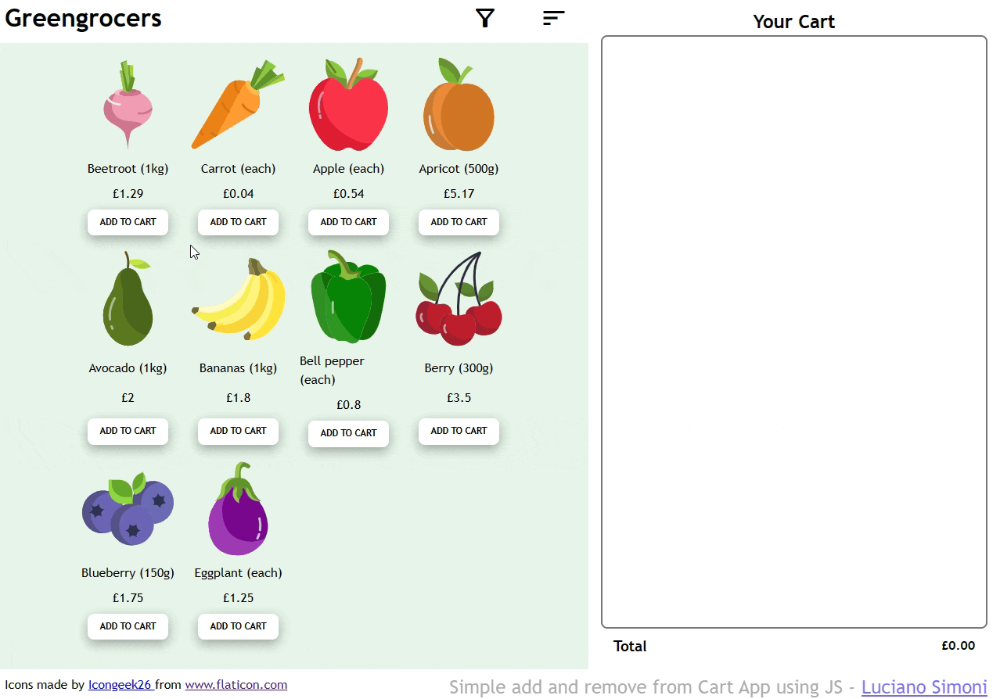

# Greengrocers Basket

## Tech stack

  
  
  

## User Requirements:
  - A user can view a selection of items in the store
  - From the store, a user can add an item to their cart
    - If the item is already in the cart, increase the item's quantity in the cart
  - From the cart, a user can view and adjust the number of items in their cart
      - If an item's quantity equals zero it is removed from the cart
  - A user can view the current total in their cart
